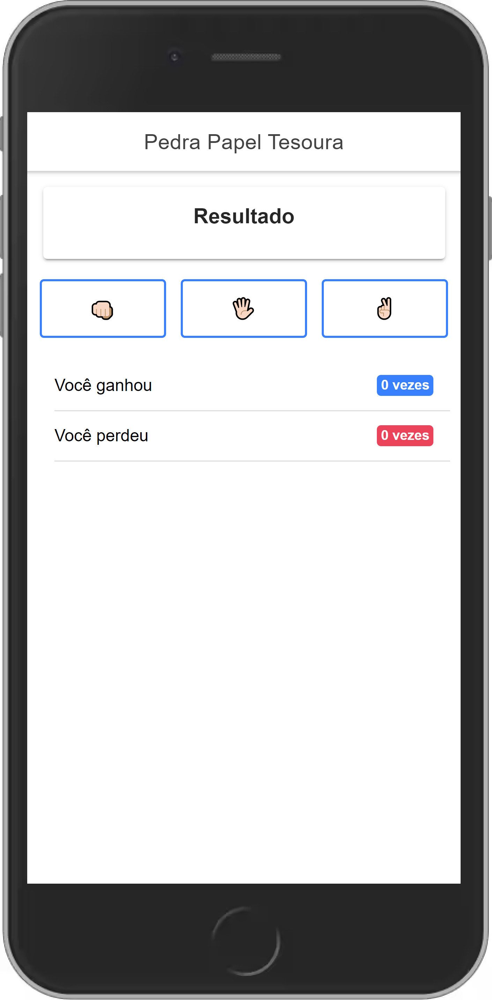

  
  # 📖 Projeto  

O projeto foi desenvolvido usando o framework ionic para fins didádicos, devido a a atualização que agora permite o desenvolvimento através de react.
  

## 🧪 Tecnologias  
  

   
  

## 🚀 Como executar  
  

Para rodar o projeto você tera que ter instalado ionic no seu pc `npm install -g @ionic/cli` depois clone o repo e rode `npm install` e depois `ionic serve` ative o modo responsivo e selecione o dispositivo desejado.
